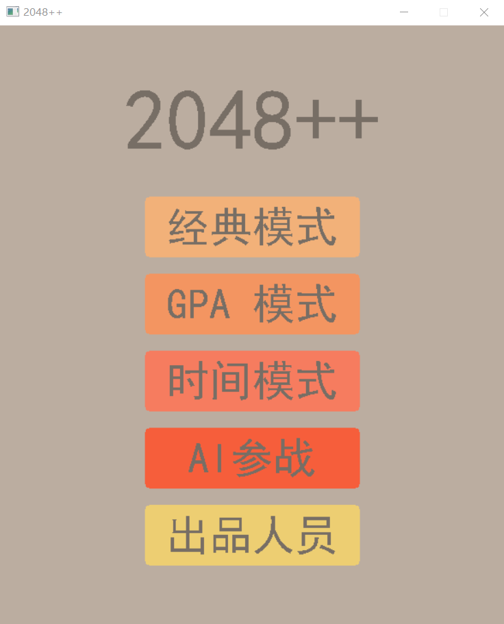
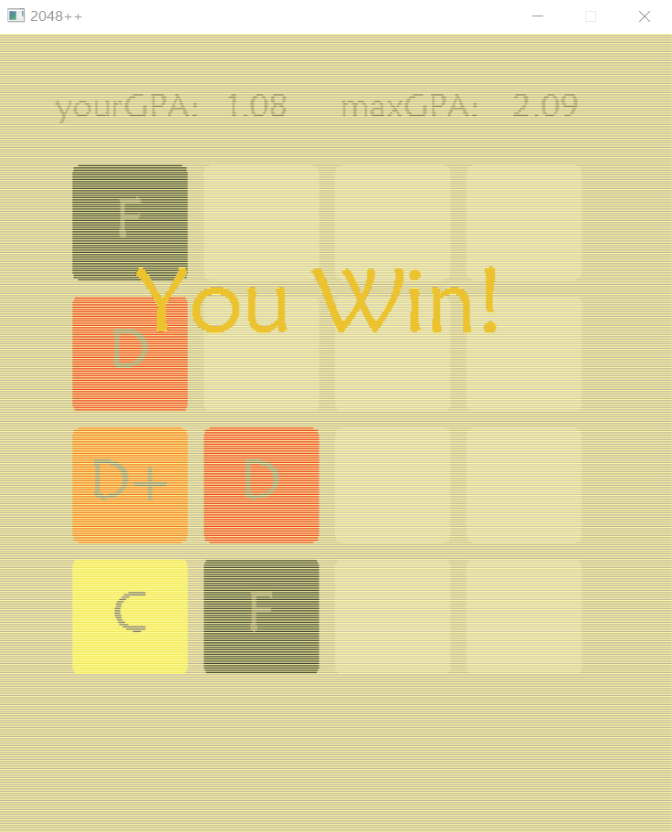
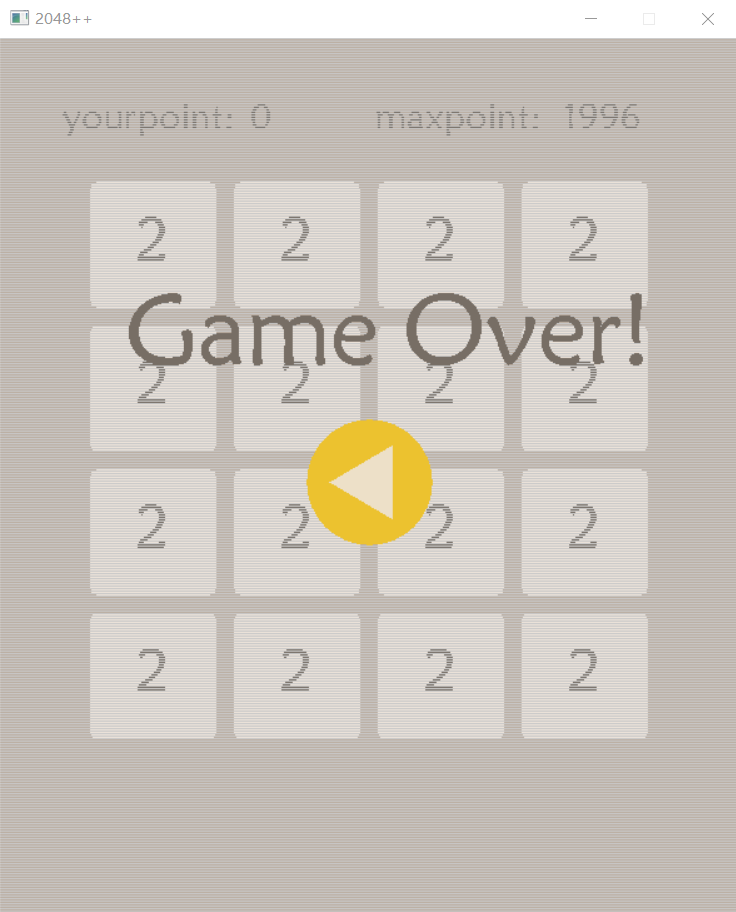

# 2048-AI-cpp
2048 game and AI written in C++ code.



Debug and Release through Visual Studio on Windows system. 
Needs the EasyX library to be installed for GUI interface.

## Quick Start
```
cd Cproject\Project2048\x64\Release
Project2048.exe
```
